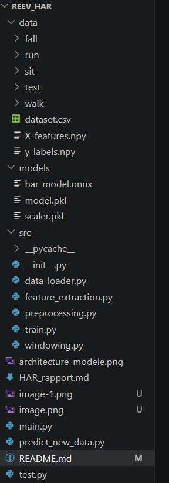
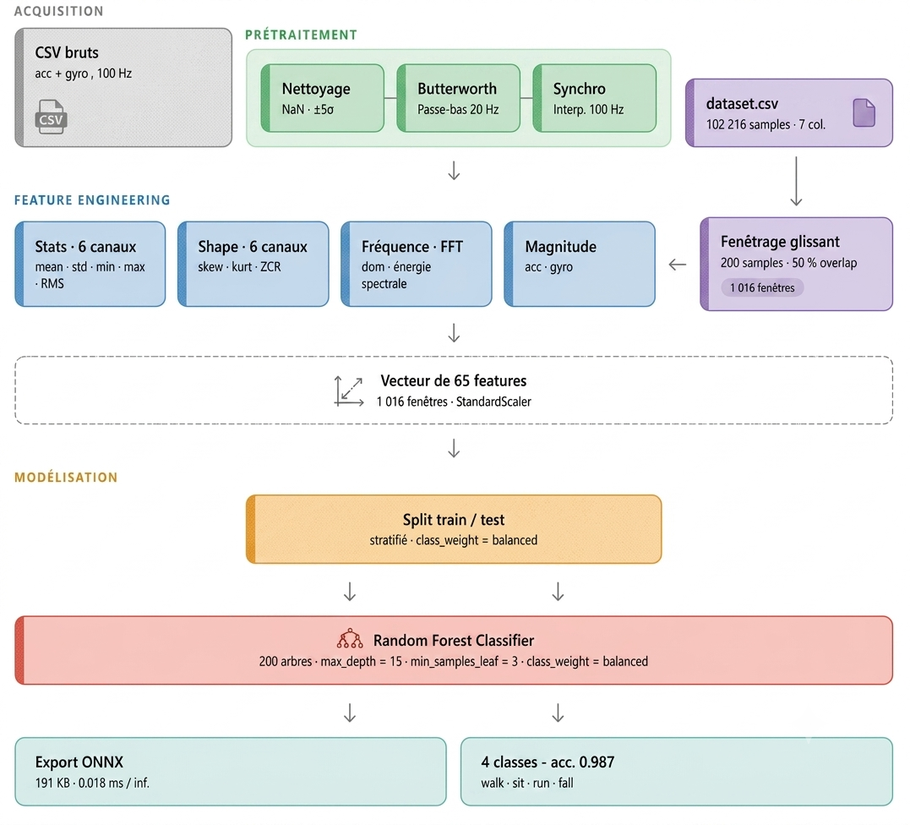

# Human Activity Recognition for Knee Orthosis

Real-time activity classification from IMU signals for a motorized knee orthosis — Random Forest classifier exported to ONNX for embedded deployment.

**Classes:** Walk · Sit · Run · Fall  
**Sensor:** Smartphone IMU (accelerometer + gyroscope) · 100 Hz  
**Model:** Random Forest → ONNX · 191 KB · 0.018 ms inference

## Repository structure


## Pipeline Overview

``
1.Raw IMU Signals |
2.Preprocessing
(Cleaning + Filtering + Synchronization)
       │
3.dataset.csv
       │
4.Sliding Window
(200 samples, 50% overlap)
       │
5.Feature Extraction
(65 features)
       │
6.standardScaler
       │
7.Random Forest
       │
8.ONNX Export
       │
Embedded Deployment
``
## Setup
This project uses a standard Python environment.

### 1. Clone the repository

```bash
git clone https://github.com/MayaSML/Human-Activity-Recognition-for-Knee-Orthosis.git
cd Human-Activity-Recognition-for-Knee-Orthosis
```
### 2. Create a virtuel environnement 
````bash
python -m venv .venv
````
### 3. Activate the environment

```bash
source .venv/bin/activate       # macOS / Linux
.venv\Scripts\activate          # Windows
```

## 4. Install dependencies
````
pip install numpy pandas scipy scikit-learn matplotlib onnx onnxruntime skl2onnx
````

##  Reproduce the experiment

The full pipeline (data loading → preprocessing → feature extraction → training → ONNX export → latency benchmark) is executed through a single script:

```bash
python -m src.main
 ```

## Dataset

| Parameter | Value |
|-----------|-------|
| Sensor | Smartphone IMU (Phyphox app) |
| Signals | Accelerometer + Gyroscope (3 axes each) |
| Sampling rate | 100 Hz |
| Position | Front trouser pocket |
| Total duration | ~17 min |
| Total samples | 102 216 |

| Class | Samples | Duration |
|-------|--------:|----------:|
| Walk  | 30 927  | ~5 min    |
| Fall  | 32 433  | ~5 min 24s|
| Run   | 22 493  | ~3 min 45s|
| Sit   | 16 363  | ~2 min 44s|

## Preprocessing

1. **Missing value removal** — NaN rows dropped
2. **Outlier clipping** — values clipped at ±5σ (except Fall class, to preserve impact peaks)
3. **Butterworth low-pass filter** — order 4, cutoff 20 Hz (human motion < 10 Hz)
4. **Sensor synchronization** — linear interpolation at 100 Hz, accelerometer and gyroscope aligned
5. **Output** — `dataset.csv` (7 columns: `acc_x`, `acc_y`, `acc_z`, `gyro_x`, `gyro_y`, `gyro_z`, `label`)

## Feature engineering

**Sliding window:** 200 samples (2 s), 50 % overlap, step = 1 s → **1 016 windows**

The 2 s window captures a full locomotion cycle. 50 % overlap increases training data and reduces the risk of missing short events like falls.

**65 features per window:**

| Group | Features | Count |
|-------|----------|------:|
| Temporal stats (× 6 channels) | mean, std, min, max, RMS | 30 |
| Signal shape (× 6 channels) | skewness, kurtosis, zero-crossing rate | 18 |
| Frequency / FFT (× 6 channels) | dominant frequency, spectral energy | 12 |
| Global magnitude | acc (mean, std, max), gyro (mean, std) | 5 |
| **Total** | | **65** |

All features normalized with `StandardScaler` fitted on the train set only.

## Model

**Algorithm:** Random Forest Classifier (scikit-learn)

| Hyperparameter | Value | Justification |
|----------------|------:|---------------|
| `n_estimators` | 200 | Stabilizes variance without increasing inference cost |
| `max_depth` | 15 | Limits overfitting on a small dataset |
| `min_samples_leaf` | 3 | Improves generalization |
| `class_weight` | balanced | Compensates class imbalance (Sit underrepresented) |

**Train / Validation / Test split:** 70 % / 15 % / 15 % — stratified by class

## Model Architecture



## Results

| Set | Accuracy |
|-----|----------:|
| Train | 0.999 |
| Validation | 0.987 |
| Test | 0.987 |
| Out-of-distribution session | 0.991 |

**Classification report (test set):**

| Class | Precision | Recall | F1-score | Support |
|-------|----------:|-------:|---------:|--------:|
| Walk  | 1.00 | 0.96 | 0.98 | 46 |
| Sit   | 1.00 | 1.00 | 1.00 | 24 |
| Run   | 1.00 | 1.00 | 1.00 | 34 |
| Fall  | 0.96 | 1.00 | 0.98 | 49 |

The 2 observed errors (Walk → Fall) are caused by abrupt phone movements when pocketing the device, generating acceleration peaks similar to fall impacts. No critical errors on Fall detection (recall = 1.00).

## On-device performance

The full pipeline (scaler + model) is exported to **ONNX** format.

| Metric | Value |
|--------|------:|
| Model size | 191 KB |
| Mean inference latency | 0.018 ms |
| P95 latency | 0.023 ms |
| P99 latency | 0.036 ms |
| Decision period | 1 s (sliding window step) |

Inference latency is **55× lower** than the decision period, making the system fully compatible with real-time embedded deployment.

*Benchmarked on CPU (standard laptop). Performance may vary on target hardware (smartphone / embedded MCU).*

## Limitations

- Dataset limited to ~17 min of data from a single subject
- Fall sequences are simulated, not real falls
- Validation limited to walk class on out-of-distribution data
- Sensitivity to smartphone position variations not fully evaluated


